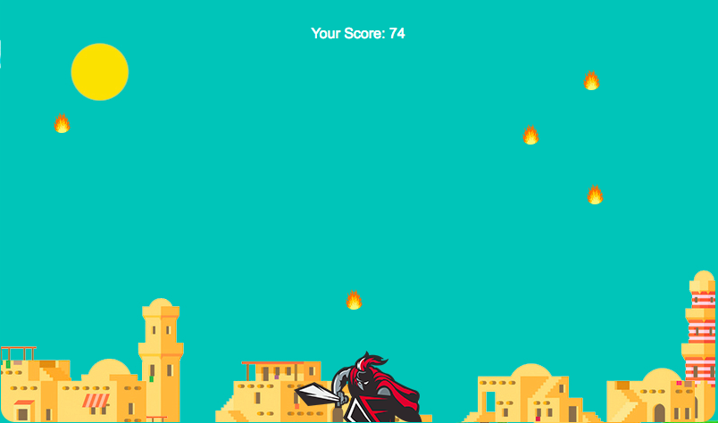

# <p align="center"> Sparta Core Project One</p>
<hr>

#### Task:
A week long project with an objective of creating a browser based game using html, css and javascript.

#### It must have/be:
* Instructions
* Game over screen (with score)
* Styled
* Hosted online
* Score
* Fully functional
* Implemented DRY Practices
* Good Quality Markdown
* Fully Git Tracked/Synced with Github
* Proper HTML/JS/CSS Code Standards (Indentation, spacing, naming conventions)


# <p align="center"> My Game - BRICKless BREAKout</p>

**Description** - My game is based on the classic game 'Breakout' originally released in 1976 by Atari. My version has a twist - there aren't any bricks. My game works uses the follwing mechanics:

* Every time a ball on screen hits the top of the frame, another ball enters the scene and you the player earn a point
* If you miss a ball and that ball hits the bottom of the frame, the ball is lost
* The game ends when all the balls on the screen have been lost – so keep them for as long

**Story for my Game:** - You, the paddle Spartan, are a glorified warrior with many accolades. The champion of champions.
At the bottom of the screen is your home land, Sparta.
Balls of fire are being rained upon your land and it is your job to protect it as best as you can
You know it’s a suicide mission but honor is everything to you and you would rather die than to flee, allowing your home to be destroyed
Deflect the balls of fire for as long as you can to prove that YOU are the ultimate warrior!

A wise man once said:
> “The mightiest warriors understand that their inevitable demise will be due to a deep love for something or someone, so die hard and die strong.”

**My MVP:**

* Paddle movement
* Movement of the first ball on the screen
* Addition of balls when any ball hits the top of the frame
* Score function
* Game Over screen
* Start button
* Reset button
* Instructions section


<hr>


**GitHub URL:**
[https://github.com/ACKAdeyemi/sparta-custom-bootstrap](https://github.com/ACKAdeyemi/sparta-custom-bootstrap)

**Demo Site URL:**
[https://github.com/ACKAdeyemi/sparta-custom-bootstrap](https://github.com/ACKAdeyemi/sparta-custom-bootstrap)

**How to Download** - click 'clone or download' button, download a zip of our project, unzip, open the index.html and enjoy.

#### Challenges:
* Paddle and ball collisions
* Ball movement
* Adding balls to the scene that have independent movement i.e. angular movement, positoning and speed particular to itself
* Creating ‘simple’/DRY functions that do complex things


Code Snippet of the code I eventually made to make my balls move:

```javascript
// JAVASCRIPT CODE
function ballCounterUpdate() {
    if (ballHitTop === true) {
      ballCounter++;
      console.log(`Ball counter is ${ballCounter}`);
    }
    if (ballCounter === 5) { // 1st hit to the top of screen, adds 2nd ball movement
      setInterval(ball2,5);
    }
    if (ballCounter === 10) {  // 2nd hit to the top of screen, adds 3rd ball movement
      setInterval(ball3,7);
    }
    if (ballCounter === 15) { // 3rd hit to the top of screen, adds 4th ball movement
      setInterval(ball4,6);
    }
    if (ballCounter === 20) {  // 4th hit to the top of screen, adds 5th ball movement
      setInterval(ball5,4);
    }
  }
```
<hr>

# <p align="center"> index/Home page screenshot</p>

